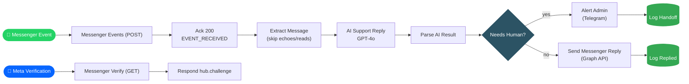

<div align="center">

# BhashaBot

**AI That Replies to Your Facebook Messages in Their Language**

Understands 18 languages — including real Bangla / Banglish — detects sentiment, intent & leads in one AI call, and knows when to hand off to a human.

<br/>

<a href="https://n8n.io"></a>
<a href="https://openai.com"></a>
<a href="https://developers.facebook.com/docs/messenger-platform"></a>
<a href="#"></a>
<a href="#"></a>
<br/>


</div>

<br/>

## Overview

**BhashaBot** *(Bhasha = "language")* is an n8n workflow that turns a Facebook Page inbox into a 24/7 multilingual support agent. It reads incoming Messenger messages, works out what language the customer is actually using — including natural, human-sounding **Bangla and Banglish** — and replies instantly in that same language and tone. Along the way it silently tags sentiment, intent, and any lead details the customer shares, and the instant a conversation turns into a refund, complaint, legal issue, or emergency, it stops guessing and pulls in a human.

<div align="center">

*One webhook. One AI call. One decision point.*

</div>

<br/>

## Highlights

<table>
<tr>
<td width="50%" valign="top">

**🌐 True multilingual replies**
Detects the customer's language across 18 supported languages and replies in kind — no stiff, translated-sounding output.

**🗣️ Real Bangla, not Google Translate Bangla**
Understands Banglish ("*price koto? ami order korte chai*") and matches formal vs. informal register automatically.

**🧠 One AI call, five jobs**
A single GPT-4o call returns language, reply, sentiment, intent, lead data, and a handoff flag as structured JSON.

</td>
<td width="50%" valign="top">

**🙋 Knows its limits**
Refunds, complaints, legal issues, abuse, cancellations, failed payments, and emergencies are routed straight to a human — no attempted fix.

**📋 Full conversation logging**
Every message is logged to Google Sheets with sentiment, intent, latency, and status for later review.

**✅ Meta-ready out of the box**
A dedicated verification webhook handles the `hub.challenge` handshake automatically.

</td>
</tr>
</table>

<br/>

## How it works



<br/>

## Workflow nodes

| Node | Type | Role |
|---|---|---|
| `Messenger Events (POST)` | Webhook | Entry point for all Messenger events |
| `Ack 200` | Respond to Webhook | Immediately acknowledges receipt to Meta |
| `Extract Message` | Code | Filters echoes/read receipts, pulls sender ID + text |
| `AI Support Reply` | OpenAI (GPT-4o) | Language detection + reply + sentiment + intent + lead capture + handoff decision |
| `Parse AI Result` | Code | Safely parses the AI's JSON, with a safe fallback |
| `Needs Human?` | IF | Routes between AI-resolved and human-handoff paths |
| `Send Messenger Reply` | Graph API | Sends the AI's reply back to the user |
| `Alert Admin (Handoff)` | Telegram | Pings the admin with context when a human is needed |
| `Log Replied` / `Log Handoff` | Google Sheets | Appends a full audit row per conversation |
| `Messenger Verify (GET)` | Webhook | Handles Meta's webhook verification handshake |
| `Respond Challenge` | Respond to Webhook | Echoes `hub.challenge` back to Meta |

<br/>

## Setup

1. **Import** `AI_Messenger_Auto_Reply.json` into your n8n instance.
2. **Connect credentials:**

   | Credential | Status |
   |---|---|
   | OpenAI | ✅ already wired via n8n free credits |
   | Facebook Graph API (`Send Messenger Reply`) | ⬜ needed |
   | Telegram Bot + admin chat ID (`Alert Admin`) | ⬜ needed |
   | Google Sheets + `Logs` tab | ⬜ needed |

3. **Set your Messenger webhook URL** in the Meta App dashboard:
   ```
   https://<your-n8n-domain>/webhook/messenger
   ```
   This single endpoint handles both the `GET` verification handshake and `POST` events.
4. **Publish/activate** the workflow before Meta can reach it.

<br/>

## Logged fields

`timestamp` · `workflow` · `user` · `language` · `message` · `reply` · `sentiment` · `intent` · `status` · `latency_ms` · `error`

<br/>

## Verification status

> Logic and wiring have been verified end-to-end with **mocked** AI, Telegram, Graph API, and Sheets nodes. A live, no-mock run has not been performed yet — complete the credential setup above before going live.

<br/>

## Roadmap

- [ ] Error-handling workflow (retry + Telegram alert + error log)
- [ ] Workflow: Auto Facebook Posting
- [ ] Workflow: Comment Auto-Reply
- [ ] Analytics store decision (Google Sheets vs n8n Data Tables)

<br/>

<div align="center">
<sub>Built on <a href="https://n8n.io">n8n</a> · Powered by GPT-4o</sub>
</div>
